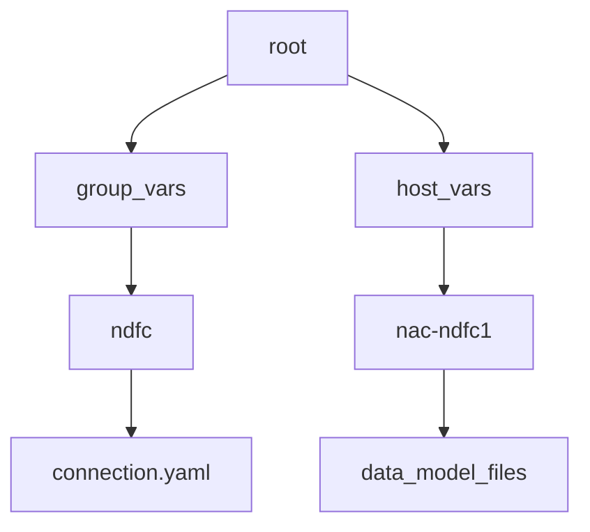

# Ansible Solution Collection: nac_dc_vxlan


NetAsCode DC VXLAN (nac_dc_vxlan) Ansible Collection for configuring Cisco VXLAN EVPN fabrics using the Cisco Nexus Dashboard Fabric Controller (NDFC). This collection simplifies the configuration of VXLAN fabrics by abstracting the automation using a [data model](https://netascode.cisco.com/docs/data_models/vxlan/overview/) that represents the desired state of the fabric. With this collection, an operator only needs to modify the configuration state in the data model instead of creating custom playbooks with modules and the associated parameters.

This approach allows for consistent and repeatable configuration of VXLAN fabrics and aligns with Infrastructure as Code (IaC) methodology, where the configuration state of NDFC is saved in a version control system and managed as code.

Infrastructure as code (IaC) is a DevOps methodology that uses code to manage and provision IT infrastructure, bypassing manual procedures. IaC uses a descriptive coding language to automate the provisioning of servers, operating systems, network devices and more.

In easy-to-understand YAML the NetAsCode VXLAN EVPN collection allows you to configure data structures describing the configuration state of a VXLAN fabric for [Cisco Nexus](https://www.cisco.com/site/us/en/products/networking/cloud-networking-switches/index.html) datacenters and then deploys this state using Ansible and the [Cisco Nexus Dashboard](https://www.cisco.com/site/us/en/products/networking/cloud-networking/nexus-platform/index.html). With little to no knowledge about automation, you can use this collection to instantiate a VXLAN EVPN fabric.

YAML files are created that contain a pre-determined data schema which is translated into underlying Ansible modules and resources. The core Ansible Collection is open source and available. This collection is designed to be used in a CI/CD pipeline in order to drive this declarative method of configuring a VXLAN fabric.

> [!NOTE]
> For complete support and additional capabilities, Cisco provides a
> professional services capability under the [Services as Code](https://www.cisco.com/c/en/us/services/collateral/se/services-as-code-aag.html)
> portfolio of services which can provide feature creation, end to end support
> and more.

## Understanding our Ansible Roles

### Validate Role

Role: [cisco.nac_dc_vxlan.validate](https://github.com/netascode/ansible-dc-vxlan/blob/develop/roles/validate/README.md)

The `validate` role ensures that the data model is correct and that the data model can be processed by the subsequent roles. The validate role reads all the files in the `host_vars` directory and creates a single data model in memory for execution.

As part of the VXLAN as Code service from Cisco, you will also be able to utilize the semantic validation feature to make sure that the data model matches the intended expected values. This is a powerful feature that allows you to ensure that the data model is correct before it is deployed to the network. Additonally the validate role allows creation of rules that can be used to prevent operators from making specific configurations that are not allowed in the network. These can be as simple as enforcing proper naming conventions to more complex rules for interconnectivity issues that should be avoided. These rules are coded in Python and can be constructed as part of the Services as Code offer. 

### Create Role

Role: [cisco.nac_dc_vxlan.dtc.create](https://github.com/netascode/ansible-dc-vxlan/blob/develop/roles/dtc/create/README.md)

The `create` role builds all of the templates and variable parameters required to deploy the VXLAN fabric and creates fabric state in NDFC. The data model is converted into the proper templates required by the Ansible modules used to communicate with the NDFC controller and manage the fabric state. The `create` role has a dependency on the `validate` role.

### Deploy Role

Role: [cisco.nac_dc_vxlan.dtc.deploy](https://github.com/netascode/ansible-dc-vxlan/blob/develop/roles/dtc/deploy/README.md)

The `deploy` role deploys the fabric state created using the Create role to the NDFC managed devices. The `deploy` role has a dependency on the `validate` role.

### Remove Role

Role: [cisco.nac_dc_vxlan.dtc.remove](https://github.com/netascode/ansible-dc-vxlan/blob/develop/roles/dtc/remove/README.md)

The `remove` role removes state from the NDFC controller and the devices managed by the NDFC controller. When the collection discovers managed state in NDFC that is not defined the the data model it gets removed by this role.  For this reason this role requires the following variables to be set to `true` under the `group_vars` directory. This avoids accidental removal of configuration from NDFC that might impact the network. The `remove` role has a dependency on the `validate` role.

Inside the [example repository](https://github.com/netascode/ansible-dc-vxlan-example) under `group_vars/ndfc` is a file called `ndfc.yaml` that contains the variables:

```yaml
# Control Parameters for 'Remove' role tasks in VXLAN EVPN fabric
interface_delete_mode: false
inventory_delete_mode: false
link_fabric_delete_mode: false
link_vpc_delete_mode: false
network_delete_mode: false
policy_delete_mode: false
vpc_delete_mode: false
vrf_delete_mode: false

# Control Parameters for 'Remove' role tasks in Multisite fabric
multisite_child_fabric_delete_mode: false
multisite_network_delete_mode: false
multisite_vrf_delete_mode: false
```

> [!WARNING]
> These variables are set to `false` by default to avoid accidental removal of
> configuration from NDFC that might impact the network.

### Advantages of the Roles in the Workflow

These roles when run in sequence (`validate`, `create`, `deploy`, `remove`) are
designed to build out the entire fabric and can be executed by a pipeline.  The
roles can also be run in isolation by simply commenting out the roles that are
not required during testing and fabric buildout to validate incremental changes.

## Control Variables

The following control variables are available in this collection.

| Variable | Description | Default Value |
| -------- | ------- | ------- |
| `force_run_all` | Force all roles in the collection to run | `false` | 
| `interface_delete_mode` | Remove interface state as part of the remove role | `false` |
| `inventory_delete_mode` | Remove inventory state as part of the remove role | `false` |
| `link_vpc_delete_mode` | Remove vpc link state as part of the remove role | `false` |
| `multisite_child_fabric_delete_mode` | Remove child fabric from MSD fabric as part of the remove role | `false` |
| `multisite_network_delete_mode` | Remove network state as part of the remove role for multisite (MSD) fabrics | `false` |
| `multisite_vrf_delete_mode` | Remove vrf state as part of the remove role for multisite (MSD) fabrics | `false` |
| `network_delete_mode` | Remove network state as part of the remove role | `false` |
| `policy_delete_mode` | Remove policy state as part of the remove role | `false` |
| `vrf_delete_mode` | Remove vrf state as part of the remove role | `false` |
| `vpc_delete_mode` | Remove vpc pair state as part of the remove role | `false` |

These variables are described in more detail in different sections of this document.

The default settings can be overridden in `group_vars`.

## Quick Start Guide

### Set Environment for the Collection

Installation of a Python virtual environment is needed in order to install the
collection and its requirements. We recommend [pyenv](https://github.com/pyenv/pyenv)
which provides a robust Python virtual environment capability that also allows
for management of different Python versions. The following instructions are
detailed around using pyenv. For pipeline execution please refer to the pipeline
section which is documented at container level.

#### Step 1 - Installing the Example Repository

To simplify getting started with this collection we provide you with an
[example repository](https://github.com/netascode/ansible-dc-vxlan-example).
Simply clone this repo from GitHub to create the required skeleton, including
examples for pipelines. Cloning the repository requires the installation of
[git client](https://git-scm.com/downloads) which is available for all
platforms.

Run the following command in the location of interest.

```bash
git clone https://github.com/netascode/ansible-dc-vxlan-example.git nac-vxlan
```

This will clone the example repository into the directory `nac-vxlan`. Next delete the `.git` repository to remove the connection to the example repository. Now you can create your own repository from this pre-built structure.

#### Step 2 - Create the Virtual Environment with pyenv

In this directory create a new virtual environment and install a Python version of your choice. At the time writing, Python version 3.10.13 is commonly used. Command `pyenv install 3.10.13` will install this version. For detailed instructions please visit the [pyenv](https://github.com/pyenv/pyenv) site.


```bash
cd nac-vxlan
pyenv virtualenv <python_version> nac-ndfc
pyenv local nac-ndfc
```

Executing command `pyenv local nac-ndfc` sets the environment so that whenever the directory is entered it will change into the right virtual environment.

#### Step 3 - Install Ansible and Additional Required Tools

Included in the example repository is the requirements file to install ansible. First upgrade PIP to latest version.

```bash
pip install --upgrade pip
pip install -r requirements.txt
```

#### Step 4 - (Option 1) - Install Ansible Galaxy Collection (default placement)

The default placement of the ansible galaxy collections would be in your home directory under `.ansible/collections/ansible_collections/`. To install the collection in the default location run the following command:

```bash
ansible-galaxy collection install -r requirements.yaml
```

#### Step 4 - (Option 2) Install Ansible Galaxy Collection (non-default placement)

If you wish to install the galaxy collection inside the repository you are creating with this example repository, you can run the following command:

```bash
ansible-galaxy collection install -p collections/ansible_collections/ -r requirements.yaml
```

The `ansible.cfg` file needs to be configured to point to the location of the collection. 

This is the path for all the python modules and libraries of the virtual environment that were created. If you look in that directory, you will find the collections package locations. Here is the base ansible.cfg, you will need to adjust the collections_path to your environment paths:

```bash
[defaults]
collections_path = ./collections/ansible_collections/

```

#### Step 5 - Change Ansible Callbacks

If you wish to add any ansible callbacks (those listed below expand on displaying time execution) you can add the following to the ansible.cfg file:

```ini
callback_whitelist=ansible.posix.timer,ansible.posix.profile_tasks,ansible.posix.profile_roles
callbacks_enabled=ansible.posix.timer,ansible.posix.profile_tasks,ansible.posix.profile_roles
bin_ansible_callbacks = True
```

#### Step 6 - Verify the Installation

Verify that the ansible configuration file is being read and all the paths are correct inside of this virtual environment. 

```bash
ansible --version

ansible [core 2.16.3]
  config file = /Users/username/tmp/nac-vxlan/ansible.cfg
  configured module search path = ['/Users/username/.ansible/plugins/modules', '/usr/share/ansible/plugins/modules']
  ansible python module location = /Users/username/.pyenv/versions/3.10.13/envs/nac-ndfc/lib/python3.10/site-packages/ansible
  ansible collection location = /Users/username/path/to/collections/ansible_collections
  executable location = /Users/username/.pyenv/versions/nac-ndfc/bin/ansible
  python version = 3.10.13 (main, Oct 29 2023, 00:04:17) [Clang 15.0.0 (clang-1500.0.40.1)] (/Users/username/.pyenv/versions/3.10.13/envs/nac-ndfc/bin/python3.10)
  jinja version = 3.1.4
  libyaml = True
```

### Inventory Host Files

As is standard with Ansible best practices, inventory files provide the destination targets for the automation. For this collection, the inventory file is a YAML file that contains the information about the devices that are going to be configured. The inventory files is called `inventory.yaml` and is located in the root of the repository.

The inventory file is going to contain a structure similar to this:

```yaml
---
all:
  children:
    ndfc:
      hosts:
        nac-ndfc1:
          ansible_host: "{{ lookup('ansible.builtin.env', 'ND_HOST') }}"
```

This structure creates two things in Ansible, a group called `ndfc` and a host called `nac-ndfc1:`. These are tied back to the directory structure of the repository that contains two folders in the top directory:



The data model is **required** to exist under the `host_vars` directory structure. The inventory file organizes how the variables are read through both the group_vars and the host_vars. Under the group_vars is where you will set the `connection.yaml` file that has the credentials of the NDFC controller. Under the `host_vars` is where we will place the inventory.

The collection is **pre-built** to utilize the `group_vars` and `host_vars` matching what is already constructed in the repository. Currently this methodology is a 1:1 relationship between code repository and NDFC fabric. For more complex environments, the inventory file can be expanded to include multiple groups and hosts including the usage of multi-site fabrics as explained in a separate document.


#### Step 1 - Update the Inventory File

In the provided `inventory.yaml` file in the project's root directory, update
the `ansible_host` variable to point to your NDFC controller by replacing `"{{ lookup('ansible.builtin.env', 'ND_HOST') }}"` with the IP address of the
NDFC controller or setting the ```ND_HOST``` environment variable as described
in Step 3.


#### Step 2 - Configure Ansible Connection File

In the directory `group_vars/ndfc` is a file called `connection.yaml` that contains example data as:

```yaml
---
# Connection Parameters for 'ndfc' inventory group
#
# Controller Credentials
ansible_connection: ansible.netcommon.httpapi
ansible_httpapi_port: 443
ansible_httpapi_use_ssl: true
ansible_httpapi_validate_certs: false
ansible_network_os: cisco.dcnm.dcnm
# NDFC API Credentials
ansible_user: "{{ lookup('env', 'ND_USERNAME') }}"
ansible_password: "{{ lookup('env', 'ND_PASSWORD') }}"
# Credentials for devices in Inventory
ndfc_switch_username: "{{ lookup('env', 'NDFC_SW_USERNAME') }}"
ndfc_switch_password: "{{ lookup('env', 'NDFC_SW_PASSWORD') }}"

```

This file is going to contain the connection parameters for reachability to the
NDFC controller. The `ansible_user`, and `ansible_password` are set to establish
connection to the NDFC controller. For the devices, you will set separate
variables also configured as environment variables.

> [!IMPORTANT]
> The usage of environment variables is done for security reasons, so that the
> credentials are not stored in plain text in the repository. Accidentally
> including your credentials in a repository is very hard to remove. Hence, the
> usage of environment variables is recommended as a starting point.
>
> Also, if you plan to eventually utilize a pipeline, the environment variables
> can be set in the pipeline configuration in a secure manner that is not
> exposed to the repository.
>
> The usage of [Ansible vault](https://docs.ansible.com/ansible/latest/vault_guide/index.html)
> is also possible to encrypt the contents of the connection file or simply
> encrypt the variables.

#### Step 3 - Set Environment Variables

The environment variables are set in the shell that is going to execute the playbook. The environment variables are configured via the `export` command in the shell (bash). Using this template, set the environment variables to the correct credentials for the NDFC controller and the devices in the inventory on your topology.

```bash
# These are the credentials for ND/NDFC
export ND_HOST=10.15.0.11
export ND_DOMAIN=local
export ND_USERNAME=admin
export ND_PASSWORD=Admin_123
# These are the credentials for the devices in the inventory
export NDFC_SW_USERNAME=admin
export NDFC_SW_PASSWORD=Admin_123
```

The following quickstart repository is available to provide a step by step guide for using this collection.

[Quick Start Guide Repo](https://github.com/netascode/ansible-dc-vxlan-example)

This collection is intended for use with the following release versions:

* `Cisco Nexus Dashboard Fabric Controller (NDFC) Release 12.2.1` or later.

<!--start requires_ansible-->
## Ansible Version Compatibility

This collection has been tested against following Ansible versions: **>=2.14.15**.

Plugins, roles and modules within a collection may be tested with only specific Ansible versions.
A collection may contain metadata that identifies these versions.
PEP440 is the schema used to describe the versions of Ansible.
<!--end requires_ansible-->

## Building the Primary Playbook

The following playbook for the NDFC as Code collection is the central execution point for this collection. Compared to automation in other collections, this playbook is designed to be mostly static and typically will not change. What gets executed during automation is based entirely on changes in the data model. When changes are made in the data model, the playbook will call the various roles and underlying modules to process the changes and update the NDFC managed fabric.

The playbook is located in the root of the repository and is called `vxlan.yaml`. It contains the following:

```yaml
---
# This is the main entry point playbook for calling the various
# roles in this collection.
- hosts: nac-ndfc1
  any_errors_fatal: true
  gather_facts: no

  roles:
    # Prepare service model for all subsequent roles
    #
    - role: cisco.nac_dc_vxlan.validate

    # -----------------------
    # DataCenter Roles
    #   Role: cisco.netascode_dc_vxlan.dtc manages direct to controller NDFC workflows
    #
    - role: cisco.nac_dc_vxlan.dtc.create
      tags: 'role_create'

    - role: cisco.nac_dc_vxlan.dtc.deploy
      tags: 'role_deploy'

    - role: cisco.nac_dc_vxlan.dtc.remove
      tags: 'role_remove'
```

The `host` is defined as nac-ndfc1 which references back to the `inventory.yaml` file. The `roles` section is where the various collection roles are called.

The first role is `cisco.nac_dc_vxlan.validate` which is going to validate the data model. This is a required step to ensure that the data model is correct and that the data model is going to be able to be processed by the subsequent roles.

The subsequent roles are the `cisco.nac_dc_vxlan.dtc.create`, `cisco.nac_dc_vxlan.dtc.deploy`, and `cisco.nac_dc_vxlan.dtc.remove` roles. These roles are the primary roles that will invoke changes in NDFC as described earlier.


> [!WARNING]
> For your safety as indicated [earlier](#remove-role), the `remove` role also
> requires setting some variables to `true` under the `group_vars` directory.
> This is to avoid accidental removal of configuration from NDFC that might
> impact the network. This will be covered in more detail below.

The playbook can be configured to execute only the roles that are required. For example, as you are building your data model and familiarizing yourself with the collection, you may comment out the `deploy` and `remove` roles and only execute the `validate` and `create` roles. This provides a quick way to make sure that the data model is structured correctly.

------
**Role Level Tags:**

To speed up execution when only certain roles need to be run the following role level tags are provided:

| Tag Name      | Description |
| ------------- | :---------- |
| role_validate | Select and run `cisco.nac_dc_vxlan.validate` role |
| role_create   | Select and run `cisco.nac_dc_vxlan.create` role |
| role_deploy   | Select and run `cisco.nac_dc_vxlan.deploy` role |
| role_remove   | Select and run `cisco.nac_dc_vxlan.remove` role |

> [!NOTE]
> The validate role will automatically run if tags `role_create, role_deploy, role_remove` are specified.

> [!TIP]
> Example: Selectively run `cisco.nac_dc_vxlan.create` role alone.
>
> ```bash
> ansible-playbook -i inventory.yaml vxlan.yaml --tags role_create
> ```

**Selective Execution based on Model Changes**

This collection has the capability to selectively run only sections within each role that changed in the data model.  This requires at least one run where
all of the roles and sections are executed creating previous state.  On the next run only the sections that changed in the data model will be executed.
For example, if VRFs and Networks are added/changed/removed in the model data files only the VRF and Networks sections will be run.

This capability is not available under the following conditions:

  * Control flag `force_run_all` under group_vars is set to `true`.
  * When using ansible tags to control execution.
  * When one of the following roles failed to complete on the previous run.
    * `cisco.nac_dc_vxlan.validate`
    * `cisco.nac_dc_vxlan.create`
    * `cisco.nac_dc_vxlan.deploy`
    * `cisco.nac_dc_vxlan.remove`

  If any of these conditions is true then all roles/sections will be run.

### See Also

* [Ansible Using Collections](https://docs.ansible.com/ansible/latest/user_guide/collections_using.html) for more details.

## Multi-Site Domain for VXLAN BGP EVPN Fabrics
A Multi-Site Domain (MSD) is a multifabric administrative domain that is created to manage multiple member fabrics. An MSD is a single point of control for definition of overlay VRFs and Networks that are shared across member fabrics. When you move fabrics under the MSD as child fabrics, the child fabrics share the VRFs and networks created at the MSD-level. This way, you can consistently provision VRFs and networks for different fabrics, at one go. It significantly reduces the time and complexity involving multiple fabric provisionings.

### To configure and manage MSD fabrics with VXLAN as Code, you should use the following workflow:
1. Create each member/child fabric that will be managed by MSD using the normal data models for each fabric (or use a combined data model with all child fabrics)
2. Create the MSD fabric. In the data model set the fabric type to MSD and specify each child fabric that will be managed.
   Reference the [VXLAN MultiSite Data Model](https://netascode.cisco.com/docs/data_models/vxlan/multisite/multisite/)
> [!NOTE]
> Any additional changes can be done using the MSD fabric data model or on an individual fabric basis using the respective playbooks.

## Contributing to this Collection

Ongoing development efforts and contributions to this collection are focused on new roles when needed and enhancements to current roles.

We welcome community contributions to this collection. If you find problems, please open an issue or create a PR against the [Cisco netascode_dc_vxlan collection repository](https://github.com/netascode/ansible-dc-vxlan/issues).

## Changelogs

* [Changelog](https://github.com/netascode/ansible-dc-vxlan/blob/develop/CHANGELOG.rst)

## More Information

- [Cisco Nexus Dashboard and Services Deployment and Upgrade Guide](https://www.cisco.com/c/en/us/td/docs/dcn/nd/3x/deployment/cisco-nexus-dashboard-and-services-deployment-guide-321.html) 
- [Cisco Nexus Dashboard Fabric Controller (NDFC) User Content for LAN Configuration Guide](https://www.cisco.com/c/en/us/td/docs/dcn/ndfc/1222/collections/ndfc-user-content-1222-lan.html)
- [Ansible User Guide](https://docs.ansible.com/ansible/latest/user_guide/index.html)
- [Ansible Developer Guide](https://docs.ansible.com/ansible/latest/dev_guide/index.html)

## Licensing

MIT License

Copyright (c) 2024-2025 Cisco and/or its affiliates.

Permission is hereby granted, free of charge, to any person obtaining a copy
of this software and associated documentation files (the "Software"), to deal
in the Software without restriction, including without limitation the rights
to use, copy, modify, merge, publish, distribute, sublicense, and/or sell
copies of the Software, and to permit persons to whom the Software is
furnished to do so, subject to the following conditions:

The above copyright notice and this permission notice shall be included in all
copies or substantial portions of the Software.

THE SOFTWARE IS PROVIDED "AS IS", WITHOUT WARRANTY OF ANY KIND, EXPRESS OR
IMPLIED, INCLUDING BUT NOT LIMITED TO THE WARRANTIES OF MERCHANTABILITY,
FITNESS FOR A PARTICULAR PURPOSE AND NONINFRINGEMENT. IN NO EVENT SHALL THE
AUTHORS OR COPYRIGHT HOLDERS BE LIABLE FOR ANY CLAIM, DAMAGES OR OTHER
LIABILITY, WHETHER IN AN ACTION OF CONTRACT, TORT OR OTHERWISE, ARISING FROM,
OUT OF OR IN CONNECTION WITH THE SOFTWARE OR THE USE OR OTHER DEALINGS IN THE
SOFTWARE.
