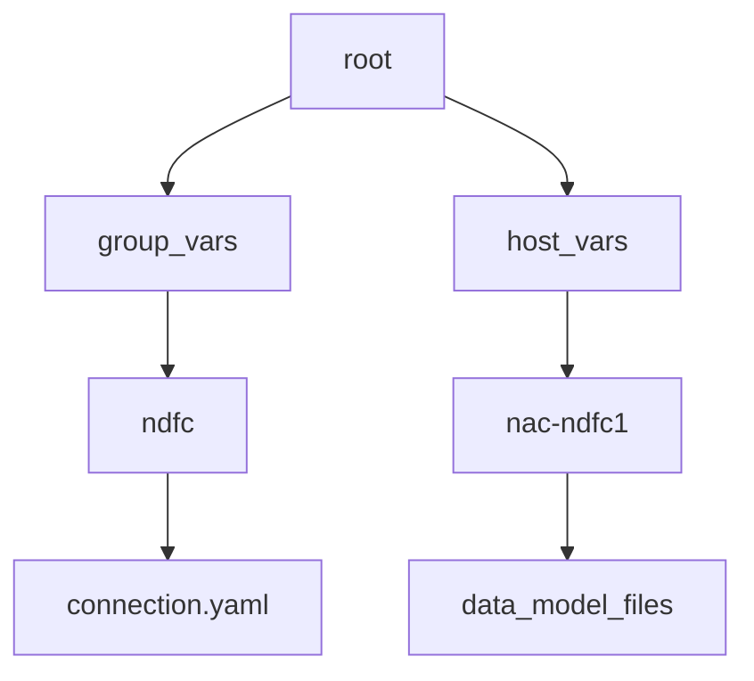

# Ansible Solution Collection:  nac_dc_vxlan (NetAsCode DC VXLAN)

[](https://github.com/netascode/ansible-dc-vxlan/actions)

Ansible collection for configuring Cisco VXLAN/EVPN fabric using Cisco Nexus Dashboard Fabric Controller (NDFC). Utilizing a foundation of a data model, this collection simplifies the configuration of VXLAN fabrics by abstracting the automation and utilizing a data model that represents the desired state of the fabric. An operator utilizing this collection will only have to modify the configuration state in the data model instead of creating the modules and the associated parameters.

This approach allows for a more consistent and repeatable configuration of VXLAN fabrics and is aligned with the methodology of infrastructure as code, where the configuration of NDFC would be saved in a version control system and managed as code.

Infrastructure as code (IaC) is a DevOps methodology that uses code to manage and provision IT infrastructure, instead of manual procedures. IaC uses a descriptive coding language to automate provisioning servers, operating systems, network devices and more. The NetAsCode VXLAN EVPN collection allows you to configure, in easy-to-understand YAML, data structures with the intended configuration state of a VXLAN fabric using Cisco Nexus Dashboard Fabric Controller.

The NetAsCode VXLAN collection provides the capability to create a declarative method of configuration of VXLAN for [Cisco Nexus](https://www.cisco.com/site/us/en/products/networking/cloud-networking-switches/index.html) datacenter solution utilizing [Cisco Nexus Dashboard](https://www.cisco.com/site/us/en/products/networking/cloud-networking/nexus-platform/index.html). This allows the separation of data from execution logic. With little to no knowledge about automation, you can instantiate a VXLAN EVPN fabric with this collection.

This is achieved by creating YAML files that contain a pre-determined data schema that is translated into underlying Ansible modules and resources. The core Ansible collection is open source and available. The collection is designed to be used in a CI/CD pipeline, which allows you to establish a declarative method of configuration of VXLAN for Cisco Nexus datacenter solution.

> **Note**: For complete support and additional capabilities, Cisco provides a professional services capability under the Services as Code portfolio of services which can provide feature creation, end to end support and more.

## Understanding our Ansible Roles

### Validate Role

Role: [cisco.nac_dc_vxlan.validate](https://github.com/netascode/ansible-dc-vxlan/blob/develop/roles/validate/README.md)

The `validate` role ensures that the data model is correct and that the data model can be processed by the subsequent roles. The validate role reads all the files in the `host_vars` directory and create a single data model in memory for execution.

As part of the VXLAN as Code service from Cisco, you will also be able to utilize the semantic validation feature to make sure that the data model matches the intended expected values. This is a powerful feature that allows you to ensure that the data model is correct before it is deployed to the network. Additonally the validate role allows creation of rules that can be used to prevent operators from making specific configurations that are not allowed in the network. These can be as simple as enforcing proper naming conventions to more complex rules for interconnectivity issues that should be avoided. These rules are coded in Python and can be constructed as part of the Services as Code offer. 

### Create Role

Role: [cisco.nac_dc_vxlan.dtc.create](https://github.com/netascode/ansible-dc-vxlan/blob/develop/roles/dtc/create/README.md)

The `create` role builds all of the templates and variable parameters required to deploy the VXLAN fabric and creates fabric state in NDFC. The data model is converted into the proper templates required by the Ansible modules used to communicate with the NDFC controller and manage the fabric state. The `create` role has a dependency on the `validate` role.

### Deploy Role

Role: [cisco.nac_dc_vxlan.dtc.deploy](https://github.com/netascode/ansible-dc-vxlan/blob/develop/roles/dtc/deploy/README.md)

The `deploy` role deploys the fabric state created using the Create role to the NDFC managed devices. The `deploy` role has a dependency on the `validate` role.

### Remove Role

Role: [cisco.nac_dc_vxlan.dtc.remove](https://github.com/netascode/ansible-dc-vxlan/blob/develop/roles/dtc/remove/README.md)

The `remove` role removes state from the NDFC controller and the devices managed by the NDFC controller. When the collection discoveres managed state in NDFC that is not defined the the data model it gets removed by this role.  For this reason this role requires the following variables to be set to `true` under the `group_vars` directory. This avoids accidental removal of configuration from NDFC that might impact the network. The `remove` role has a dependency on the `validate` role.

Inside the [example repository](https://github.com/netascode/ansible-dc-vxlan-example) under `group_vars/ndfc` is a file called `ndfc.yaml` that contains the variables:

```yaml
# Control Parameters for 'Remove' role tasks
interface_delete_mode: false
network_delete_mode: false
vrf_delete_mode: false
inventory_delete_mode: false
vpc_peering_delete_mode: false
```

**Note:** These variables are set to `false` by default to avoid accidental removal of configuration from NDFC that might impact the network.

### Advantages of the Roles in the Workflow

The primary advantage of the workflow is that you can insert these in different stages of the data model preparation and changes without having to worry about impacts to the network. In a SCM repository environment, pipelines can be configured to run the validate role before approvals in pull requests. 

The roles are designed to be idempotent and only make changes when there are changes in the data model. For different stages of changes in the network, you can comment out the roles that are not required to be executed. You can leave the final full execution potentially to only happen from a pipeline, yet allow for operators to validate changes before they are executed.

## Quick Start Guide

### Set Environment for the Collection

The first procedure for execution of the collection is going to be the installation of a virtual environment to be able to install the collection and it's requirements. Recommendation is to utilize [pyenv](https://github.com/pyenv/pyenv) which provides a robust python virtual environment capability that also includes management of python versions. These instructions will be detailed around pyenv. For the pipeline execution please refer to *pipeline section* where it is documented at container level.

#### Step 1 - Installing the Example Repository

To simplify the usage of the collection we are providing you with an [example repository](https://github.com/netascode/ansible-dc-vxlan-example) that you can clone from GitHub which creates the proper skeleton required, including examples for pipelines. To clone the repository requires the installation of [git client](https://git-scm.com/downloads) that is available for all platforms.

Run the following command in the location of interest.

```bash
git clone https://github.com/netascode/ansible-dc-vxlan-example.git nac-vxlan
```

This will clone the example repository into the directory nac-vxlan. Then you will delete the `.git` repository to remove the connection to the example repository. Which then allows you to create your own repository from this built structure.

#### Step 2 - Create the Virtual Environment with pyenv

In this directory you will now create the new virtual environment. For pyenv to work you must install a version of Python that you want to utilize. At the _time of this writing_, a common version utilized is python version 3.10.13 so to install this with pyenv would be the command `pyenv install 3.10.13`. For detailed instructions please visit the [pyenv](https://github.com/pyenv/pyenv) site.

```bash
cd nac-vxlan
pyenv virtualenv <python_version> nac-ndfc
pyenv local nac-ndfc
```

The final command is `pyenv local` which sets the environment so that whenever you enter the directory it will change into the right virtual environment.

#### Step 3 - Install Ansible and Additional Required Tools

Included in the example repository is the requirements file to install ansible. First upgrade PIP to latest version.

```bash
pip install --upgrade pip
pip install -r requirements.txt
```

#### Step 4 - (Option 1) - Install Ansible Galaxy Collection (default placement)

The default placement of the ansible galaxy collections would be in your home directory under `.ansible/collections/ansible_collections/`. To install the collection in the default location run the following command:

```bash
ansible-galaxy collection install -r requirements.yaml
```

#### Step 4 - (Option 2) Install Ansible Galaxy Collection (non-default placement)

If you wish to install the galaxy collection inside the repository you are creating with this example repository, you can run the following command:

```bash
ansible-galaxy collection install -p collections/ansible_collections/ -r requirements.yaml
```

You will need to then configure your ansible.cfg file to point to the correct location of the collection. 

This is the path for all the python modules and libraries of the virtual environment that were created. If you look in that directory, you will find the collections package locations. Here is the base ansible.cfg, you will need to adjust the collection_path to your environment paths:

```bash
[defaults]
collections_path = ./collections/ansible_collections/

```

#### Step 5 - Change Ansible Callbacks

If you wish to add any ansible callbacks ( the listed below expand on displaying time execution ) you can add the following to the ansible.cfg file:

```ini
callback_whitelist=ansible.posix.timer,ansible.posix.profile_tasks,ansible.posix.profile_roles
callbacks_enabled=ansible.posix.timer,ansible.posix.profile_tasks,ansible.posix.profile_roles
bin_ansible_callbacks = True
```

#### Step 6 - Verify the Installation

Verify that the ansible configuration file is being read and all the paths are correct inside of this virtual environment. 

```bash
ansible --version

ansible [core 2.16.3]
  config file = /Users/username/tmp/nac-vxlan/ansible.cfg
  configured module search path = ['/Users/username/.ansible/plugins/modules', '/usr/share/ansible/plugins/modules']
  ansible python module location = /Users/username/.pyenv/versions/3.10.13/envs/nac-ndfc/lib/python3.10/site-packages/ansible
  ansible collection location = /Users/username/path/to/collections/ansible_collections
  executable location = /Users/username/.pyenv/versions/nac-ndfc/bin/ansible
  python version = 3.10.13 (main, Oct 29 2023, 00:04:17) [Clang 15.0.0 (clang-1500.0.40.1)] (/Users/username/.pyenv/versions/3.10.13/envs/nac-ndfc/bin/python3.10)
  jinja version = 3.1.4
  libyaml = True
```

### Inventory Host Files

As is standard with Ansible best practices, inventory files provide the destination targets for the automation. For this collection, the inventory file is a YAML file that contains the information about the devices that are going to be configured. The inventory files is called `inventory.yaml` and is located in the root of the repository.

The inventory file is going to contain a structure similar to this:

```yaml
---
all:
  children:
    ndfc:
      hosts:
        nac-ndfc1:
          ansible_host: 10.X.X.X
```

This structure creates two things in Ansible, a group called `ndfc` and a host called `nac-ndfc1:`. These are tied back to the directory structure of the repository that contains two folders in the top directory:



The data model is **required** to exist under the `host_vars` directory structure. The inventory file is organizing how the variables are read through both the group_vars and the host_vars. Under the group_vars is where you will set the `connection.yaml` file that has the credentials of the NDFC controller. Under the `host_vars` is where we will place the inventory.

The collection is **pre-built** to utilize the `group_vars` and `host_vars` matching what is already constructed in the repository. Currently this methodology is a 1:1 relationship between code repository and NDFC fabric. For more complex environments, the inventory file can be expanded to include multiple groups and hosts including the usage of multi-site fabrics, explained in a separate document.


#### Step 1 - Update the Inventory File

In the provided `inventory.yaml` file on the root directory, update the `ansible_host` variable to point to your NDFC controller by replacing `10.X.X.X` with the IP address of the NDFC controller.


#### Step 2 - Configure Ansible Connection File

In the directory `group_vars/ndfc` is a file called `connection.yaml` that contains example data as:

```yaml
---
# Connection Parameters for 'ndfc' inventory group
#
# Controller Credentials
ansible_connection: ansible.netcommon.httpapi
ansible_httpapi_port: 443
ansible_httpapi_use_ssl: true
ansible_httpapi_validate_certs: false
ansible_network_os: cisco.dcnm.dcnm
# NDFC API Credentials
ansible_user: "{{ lookup('env', 'ansible_user') }}"
ansible_password: "{{ lookup('env', 'ansible_password') }}"
# Credentials for devices in Inventory
ndfc_device_username: "{{ lookup('env', 'ndfc_device_username') }}"
ndfc_device_password: "{{ lookup('env', 'ndfc_device_password') }}"

```

This file is going to contain the connection parameters for reachability to the NDFC controller. The `ansible_user`, and `ansible_password` are set to establish connection to the NDFC controller. For the devices, you will set separate variables also configured as environment variables. The usage of environment variables is done for security reasons, so that the credentials are not stored in plain text in the repository. Accidentally including your credentials in a repository is very hard to remove. Hence, the usage of environment variables is recommended as a starting point.

Also, if you plan to eventually utilize a pipeline, the environment variables can be set in the pipeline configuration in a secure manner that is not exposed to the repository.

The usage of [Ansible vault](https://docs.ansible.com/ansible/latest/vault_guide/index.html) is also possible to encrypt the contents of the connection file or simply encrypt the variables.

#### Step 3 - Set Environment Variables

The environment variables are set in the shell that is going to execute the playbook. The environment variables are configured via the `export` command in the shell (bash). Using this template set the environment variables to the correct credentials for the NDFC controller and the devices in the inventory on your topology.

```bash
# These are the credentials for 
export ansible_user=admin
export ansible_password=Admin_123
# These are the credentials for the devices in the inventory
export ndfc_device_username=admin
export ndfc_device_password=Admin_123
```

The following quickstart repository is available to provide a step by step guide for using this collection

[Quick Start Guide Repo](https://github.com/netascode/ansible-dc-vxlan-example)

This collection is intended for use with the following release versions:

* `NDFC Release 12.2.1` or later.

<!--start requires_ansible-->
## Ansible Version Compatibility

This collection has been tested against following Ansible versions: **>=2.14.15**.

Plugins, roles and modules within a collection may be tested with only specific Ansible versions.
A collection may contain metadata that identifies these versions.
PEP440 is the schema used to describe the versions of Ansible.
<!--end requires_ansible-->

## Building the Primary Playbook

The playbook for the NDFC as Code collection is the execution point of the this automation collection. In difference to other automation with collections, what is in this playbook is mostly static and not going to change. What is executed during automation is based on changes in the data model. Hence as changes happen in the data model, the playbook will call the modules and based on what has changed in the data model, is what is going to execute.

The playbook is located in the root of the repository and is called `vxlan.yaml`. It contains the following:

```yaml
---
# This is the main entry point playbook for calling the various
# roles in this collection.
- hosts: nac-ndfc1
  any_errors_fatal: true
  gather_facts: no

  roles:
    # Prepare service model for all subsequent roles
    #
    # - role: cisco.nac_dc_vxlan.validate

    # -----------------------
    # DataCenter Roles
    #   Role: cisco.netascode_dc_vxlan.dtc manages direct to controller NDFC workflows
    #
    - role: cisco.nac_dc_vxlan.dtc.create
    - role: cisco.nac_dc_vxlan.dtc.deploy
    - role: cisco.nac_dc_vxlan.dtc.remove
```

The `host` is defined as nac-ndfc1 which references back to the inventory file. The `roles` section is where the collection is going to be called.

The first role is `cisco.nac_dc_vxlan.validate` which is going to validate the data model. This is a required step to ensure that the data model is correct and that the data model is going to be able to be processed by the subsequent roles. **This role is going to execute by default even if not defined as it is required for the subsequent roles to execute.** In this example we are commenting out the role to show that it is not required to be defined in the playbook, but if you want to define a playbook that just runs the validation, you would uncomment this role.

The next roles are the `cisco.nac_dc_vxlan.dtc.create`, `cisco.nac_dc_vxlan.dtc.deploy`, and `cisco.nac_dc_vxlan.dtc.remove`. These roles are the primary roles that will invoke change in NDFC. The `create` role will create all the templates and variable parameters. The `deploy` role will deploy those changes to the NDFC controller. The `remove` role would remove the data model from the devices in the inventory.

> **Note**: For your safety, the `remove` role also requires settings some variables to true under the `group_vars` directory. This is done to avoid accidental removal of configuration from NDFC that might impact the network. This will be covered in a section below.


Since each of these roles are separate, you may configure the playbook to only execute the roles that are required. For example, as you are building your data model and getting to know the collection, you may comment out the `deploy` and `remove` roles to only execute the `validate` and `create` role. This provides a quick way to make sure that the data model is structured correctly.

### See Also

* [Ansible Using collections](https://docs.ansible.com/ansible/latest/user_guide/collections_using.html) for more details.

## Contributing to this Collection

Ongoing development efforts and contributions to this collection are focused on new roles when needed and enhancements to current roles.

We welcome community contributions to this collection. If you find problems, please open an issue or create a PR against the [Cisco netascode_dc_vxlan collection repository](https://github.com/netascode/ansible-dc-vxlan/issues).

## Changelogs

* [Changelog](https://github.com/netascode/ansible-dc-vxlan/blob/develop/CHANGELOG.rst)

## More Information

- [NDFC installation and configuration guides](https://www.cisco.com/c/en/us/td/docs/dcn/ndfc/1201/installation/cisco-ndfc-install-and-upgrade-guide-1201.html)
- [Ansible User guide](https://docs.ansible.com/ansible/latest/user_guide/index.html)
- [Ansible Developer guide](https://docs.ansible.com/ansible/latest/dev_guide/index.html)

## Licensing

MIT License

Copyright (c) 2024 Cisco and/or its affiliates.

Permission is hereby granted, free of charge, to any person obtaining a copy
of this software and associated documentation files (the "Software"), to deal
in the Software without restriction, including without limitation the rights
to use, copy, modify, merge, publish, distribute, sublicense, and/or sell
copies of the Software, and to permit persons to whom the Software is
furnished to do so, subject to the following conditions:

The above copyright notice and this permission notice shall be included in all
copies or substantial portions of the Software.

THE SOFTWARE IS PROVIDED "AS IS", WITHOUT WARRANTY OF ANY KIND, EXPRESS OR
IMPLIED, INCLUDING BUT NOT LIMITED TO THE WARRANTIES OF MERCHANTABILITY,
FITNESS FOR A PARTICULAR PURPOSE AND NONINFRINGEMENT. IN NO EVENT SHALL THE
AUTHORS OR COPYRIGHT HOLDERS BE LIABLE FOR ANY CLAIM, DAMAGES OR OTHER
LIABILITY, WHETHER IN AN ACTION OF CONTRACT, TORT OR OTHERWISE, ARISING FROM,
OUT OF OR IN CONNECTION WITH THE SOFTWARE OR THE USE OR OTHER DEALINGS IN THE
SOFTWARE.
