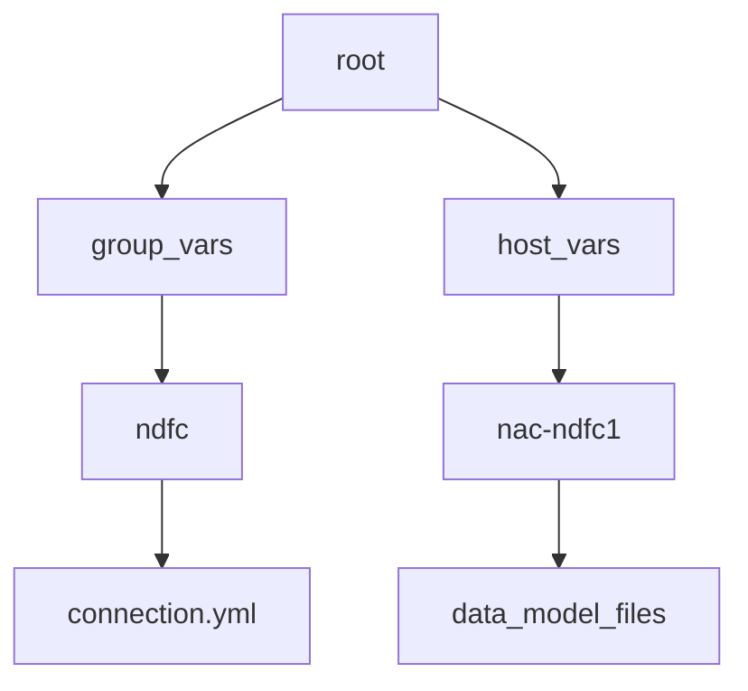
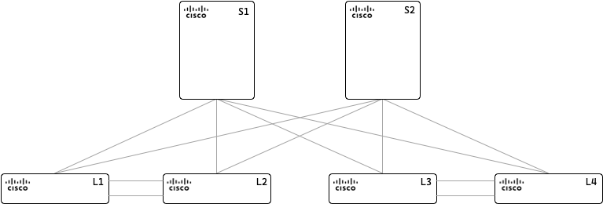

# Documentation for the netascode-dc-vxlan Ansible Collection

Infrastructure as code (IaC) is a DevOps methodology that uses code to manage and provision IT infrastructure, instead of manual procedures. IaC uses a descriptive coding language to automate provisioning servers, operating systems, network devices and more. The NetAsCode VXLAN EVPN collection allows you to configure, in easy to understand YAML, data structures with the intended configuration state of a VXLAN fabric using Cisco Nexus Dashboard Fabric Controller.

The NetAsCode VXLAN collection provides the capability to create a declarative method of configuration of VXLAN for [Cisco Nexus](https://www.cisco.com/site/us/en/products/networking/cloud-networking-switches/index.html) datacenter solution utilizing [Cisco Nexus Dashboard](https://www.cisco.com/site/us/en/products/networking/cloud-networking/nexus-platform/index.html). This allows the separation of data from execution logic. With little to no knowledge about automation, you can instantiate a VXLAN EVPN fabric with this collection.

This is achieved by creating YAML files that contain a pre-determined data schema that is translated into underlying Ansible modules and resources. The core Ansible collection is open source and available 

> **Note**: For complete support and additional capabilities, Cisco provides a profesional services capability under the Services as Code umbrella. TAC support is provided for the underlying Ansible modules.

## Setting up environment for the collection

The first procedure for execution of the collection is going to be the installation of a virtual environment to be able to install the collection and it's requirements. Recomendation is to utilize [pyenv](https://github.com/pyenv/pyenv) which provides a robust python virtual environment capability that also includes management of python versions. These instructions will be detailed around pyenv. For the pipeline execution please refer to *pipeline section* where it is documented at container level.


### Step 1 - Installing the example repository

To simplify the usage of the collection we are providing you with an [example repository](https://github.com/netascode/ansible-dc-vxlan-example) that you can clone from github which creates the proper skeleton required, including beneficial examples for pipelines. To clone the repository requires the installation of [git client](https://git-scm.com/downloads) that is available for all platforms.

Run the following command in the location of interest.

```bash
git clone https://github.com/netascode/ansible-dc-vxlan-example.git nac-vxlan
```

This will clone the repository into the directory nac-vxlan.

### Step 2 - Create the virtual environment with pyenv

In this directory you will now create the new virtual environment. For pyenv to work you have to install a version of Python that you want to utilize. At the _time of this writting_, a common version utilized is python version 3.10.13 so to install this with pyenv would be the command `pyenv install 3.10.13`. For detailed instructions please visit the [pyenv](https://github.com/pyenv/pyenv) site. 

```bash
cd nac-vxlan
pyenv virtualenv <python_version> nac-ndfc
pyenv local nac-ndfc
```

The final command is `pyenv local` which sets the environment so that whenever you enter the directory it will change into the right virtual environment.

### Step 3 - Install Ansible and additional required tools

Included in the example repository is the requirements file to install ansible. First upgrade PIP to latest version.

```bash
pip install --upgrade pip
pip install -r requirements.txt
```

### Step 4 - Install Ansible Galaxy collections

```bash
ansible-galaxy collection install -p collections/ansible_collections/ -r requirements.yml
```

### Step 5 - Ensure proper python interpreter for Ansible

Using the envirnoment variable $PYENV_VIRTUAL_ENV from pyenv you should be able to locate the proper path that will be needed to be set in the `ansible.cfg` file.

```bash
echo $PYENV_VIRTUAL_ENV/lib/
```

Which is going to tell you the path for all the python modules and libraries of the virtual environment that was created. If you look in that directory you will find the collections package locations. Here is the base ansible.cfg, you will need to adjust the collection_path to your environment paths:

```bash
[defaults]
collections_path = $PYENV_VIRTUAL_ENV/lib/python3.10/site-packages/ansible/collections:./collections/ansible_collections/

# callback_whitelist=ansible.posix.timer,ansible.posix.profile_tasks,ansible.posix.profile_roles
# callbacks_enabled=ansible.posix.timer,ansible.posix.profile_tasks,ansible.posix.profile_roles
# bin_ansible_callbacks = True
```

Verify that the ansible configuration file is being read and all the paths are correct inside of this virtual environment. 

```bash
ansible --version

ansible [core 2.16.3]
  config file = /Users/username/tmp/nac-vxlan/ansible.cfg
  configured module search path = ['/Users/username/.ansible/plugins/modules', '/usr/share/ansible/plugins/modules']
  ansible python module location = /Users/username/.pyenv/versions/3.10.13/envs/nac-ndfc/lib/python3.10/site-packages/ansible
  ansible collection location = /Users/username/.pyenv/versions/3.10.13/envs/nac-ndfc/lib/python3.10/site-packages/ansible/collections:/Users/username/tmp/nac-vxlan/collections/ansible_collections
  executable location = /Users/username/.pyenv/versions/nac-ndfc/bin/ansible
  python version = 3.10.13 (main, Oct 29 2023, 00:04:17) [Clang 15.0.0 (clang-1500.0.40.1)] (/Users/username/.pyenv/versions/3.10.13/envs/nac-ndfc/bin/python3.10)
  jinja version = 3.1.4
  libyaml = True
```

## Inventory configuration

As is standard with Ansible best practices, inventory files provide the destination targets for the automation. For this collection, the inventory file is a YAML file that contains the information about the devices that are going to be configured. The inventory files is called `inventory.yml` and is located in the root of the repository.

The inventory file is going to contain a structure similar to this:

```yaml
---
all:
  children:
    ndfc:
      hosts:
        nac-ndfc1:
          ansible_host: 10.X.X.X
```

This structure creates two things in Ansible, a group called `ndfc` and a host called `nac-ndfc1:`. These are tied back to the directory structure of the repository that contains two folders in the top directory:



The data model is **required** to exist under the `host_vars` directory structure. The inventory file is organizing how the variables are read through both the group_vars and the host_vars. Under the group_vars is where you will set the `connection.yml` file that has the credentials of the NDFC controller. Under the `host_vars` is where we will place the inventory.

The collection is **pre-built** to utilize the `group_vars` and `host_vars` matching what is already constructed in the repository. Currently this methodology is a 1:1 relationship between code repository and NDFC fabric. For more complex environments, the inventory file can be expanded to include multiple groups and hosts including the usage of multi-site fabrics, explained in a separate document.

### Step 1 - Update the inventory file

In the provided `inventory.yml` file on the root directory, update the `ansible_host` variable to point to your NDFC controller by replacing `10.X.X.X` with the IP address of the NDFC controller.


### Step 2 - Configure ansible connection file

In the directory `group_vars/ndfc` is a file called `connection.yml` that contains example data as:

```yaml
---
# Connection Parameters for 'ndfc' inventory group
#
# Controller Credentials
ansible_connection: ansible.netcommon.httpapi
ansible_httpapi_port: 443
ansible_httpapi_use_ssl: true
ansible_httpapi_validate_certs: false
ansible_network_os: cisco.dcnm.dcnm
# NDFC API Credentials
ansible_user: "{{ lookup('env', 'ansible_user') }}"
ansible_password: "{{ lookup('env', 'ansible_password') }}"
# Credentials for devices in Inventory
ndfc_device_username: "{{ lookup('env', 'ndfc_device_username') }}"
ndfc_device_password: "{{ lookup('env', 'ndfc_device_password') }}"

```

This file is going to contain the connection parameters for reachability to the NDFC controller. The `ansible_user`, and `ansible_password` are set to establish connection to the NDFC controller. For the devices, you will set separate variables also configured as environment variables. The usage of environment variables is done for security reasons, so that the credentials are not stored in plain text in the repository. Accidentaly including your credentials in a repository is a very hard to remove. Hence, the usage of environment variables is recommended as a starting point.

Also if you plan to eventually utilize a pipeline, the environment variables can be set in the pipeline configuration in a secure manner that is not exposed to the repository.

The usage of [Ansible vault](https://docs.ansible.com/ansible/latest/vault_guide/index.html) is also possible to encrypt the contents of the connection file or simply encrypt the variables.

### Step 3 - Set environment variables

The environment variables are set in the shell that is going to execute the playbook. The environment variables are configured via the `export` command in the shell (bash). Using this template set the environment variables to the correct credentials for the NDFC controller and the devices in the inventory on your topology.

```bash
# These are the credentials for 
export ansible_user=admin
export ansible_password=Admin_123
# These are the credentials for the devices in the inventory
export ndfc_device_username=admin
export ndfc_device_password=Admin_123
```

## Building the primary playbook

The playbook for the NDFC as Code collection is the execution point of the this automation collection. In difference to other automation with collections, what is in this playbook is mostly static and not going to change. What is executed during automation is based on changes in the data model. Hence as changes happen in the data model, the playbook will call the modules and based on what has changed in the data model, is what is going to execute.

The playbook is located in the root of the repository and is called `vxlan.yaml`. It contains the following:

```yaml
---
# This is the main entry point playbook for calling the various
# roles in this collection.
- hosts: nac-ndfc1
  any_errors_fatal: true
  gather_facts: no

  roles:
    # Prepare service model for all subsequent roles
    #
    - role: cisco.nac_dc_vxlan.validate

    # -----------------------
    # DataCenter Roles
    #   Role: cisco.netascode_dc_vxlan.dtc manages direct to controller NDFC workflows
    #   Role: cisco.netascode_dc_vxlan.dtd manages direct to device NXOS workflows
    #
    - role: cisco.nac_dc_vxlan.dtc.create
    - role: cisco.nac_dc_vxlan.dtc.deploy
    - role: cisco.nac_dc_vxlan.dtc.remove
```

The `host` is defined as nac-ndfc1 which references back to the inventory file. The `roles` section is where the collection is going to be called.

The first role is `cisco.nac_dc_vxlan.validate` which is going to validate the data model. This is a required step to ensure that the data model is correct and that the data model is going to be able to be processed by the subsequent roles.

The next roles are the `cisco.nac_dc_vxlan.dtc.create`, `cisco.nac_dc_vxlan.dtc.deploy`, and `cisco.nac_dc_vxlan.dtc.remove`. These roles are the primary roles that will invoke change in NDFC. The `create` role is going to create all the templates and variable parameters . The `deploy` role is going to deploy those changes to the NDFC controller. The `remove` role would remove the data model from the devices in the inventory.

> **Note**: For your safety, the `remove` role also requires settings some variables to true under the `group_vars` directory. This is to avoid accidental removal of configuration from NDFC that might impact the network. This will be covered in a section below.


Since each of these roles are separte, you may configure the playbook to only execute the roles that are required. For example, as you are building your data model and getting to know the collection, you may comment out the `deploy` and `remove` roles to only execute the `validate` and `create` role. This provides a quick way to make sure that the data model is structured correctly.

## Example topology

In this document we are going to provide an example topology that is going to be used to demonstrate the capabilities of the collection. The example topology is a simple two spine, four leaf topology.



When configuring the data model, a best practice is to not configure a single file with the whole model. This would create many problems when the data model is growing in size with more parameters added. Instead, the data model is going to be split into multiple files that are going to be read into memory by the collection under the prepare code that is under the `cisco.nac_dc_vxlan.validate` role.

All the files located in the directory for the data model under the `host_vars` directory are read all and create a single data model in memory for execution.

### Global configuration

The first file we are going to create is going be called `global.yml` and is going to contain the global parameters for the VXLAN fabric. 

```yaml
---
fabric:
  global:
    name: nac-nd-02
    bgp_asn: 65001
    route_reflectors: 2
    anycast_gateway_mac: 12:34:56:78:90:00
    dns_servers:
      - ip_address: 10.0.249.16
        vrf: management
    ntp_servers:
      - ip_address: 10.81.254.131
        vrf: management
```

### Inventory configuration

This file will be named `topology_switches.yaml`

```yaml
---
fabric:
  topology:
    switches:
      - name: spine1
        role: spine
        management:
          default_gateway_v4: 10.15.34.1
          management_ipv4_address: 10.15.34.11
        routing_loopback_id: 0
        vtep_loopback_id: 1
      - name: spine2
        role: spine
        management:
          default_gateway_v4: 10.15.34.1
          management_ipv4_address: 10.15.34.12
        routing_loopback_id: 0
        vtep_loopback_id: 1
      - name: leaf1
        role: leaf
        management:
          default_gateway_v4: 10.15.34.1
          management_ipv4_address: 10.15.34.13
        routing_loopback_id: 0
        vtep_loopback_id: 1
      - name: leaf2
        role: leaf
        management:
          default_gateway_v4: 10.15.34.1
          management_ipv4_address: 10.15.34.14
        routing_loopback_id: 0
        vtep_loopback_id: 1
      - name: leaf3
        role: leaf
        management:
          default_gateway_v4: 10.15.34.1
          management_ipv4_address: 10.15.34.15
        routing_loopback_id: 0
        vtep_loopback_id: 1
      - name: leaf4
        role: leaf
        management:
          default_gateway_v4: 10.15.34.1
          management_ipv4_address: 10.15.34.16
        routing_loopback_id: 0
        vtep_loopback_id: 1
```

### Underlay configuration

```yaml
---
fabric:
  underlay:
    general:
      routing_protocol: ospf
      enable_ipv6_underlay: false
      replication_mode: multicast
      fabric_interface_numbering: p2p
      subnet_mask: 31
      underlay_routing_loopback_id: 0
      underlay_vtep_loopback_id: 1
      underlay_routing_protocol_tag: UNDERLAY
      underlay_rp_loopback_id: 250
      intra_fabric_interface_mtu: 9216
      layer2_host_interfacde_mtu: 9216
      unshut_host_interfaces: true
    ipv4:
      underlay_routing_loopback_ip_range: 10.0.0.0/22
      underlay_vtep_loopback_ip_range: 10.100.100.0/22
      underlay_rp_loopback_ip_range: 10.250.250.0/24
      underlay_subnet_ip_range: 10.1.0.0/16
    ipv6:
      enable_ipv6_link_local_address: false
      # Ask Shangxin, can't find this property
      underlay_subnet_mask: 64
    ospf:
      area_id: 0.0.0.0
      authentication_enable: false
      authentication_key_id: 0
      authentication_key: ""
    multicast:
      underlay_rp_loopback_id: 250
      underlay_primary_rp_loopback_id: 0
```

### VRF configuration

```yaml
---
fabric:
  overlay_services:
    vrfs:
      - name: NaC-ND2-VRF01
        vrf_id: 150001
        vlan_id: 2001
        attach_group: all
      - name: NaC-ND2-VRF02
        vrf_id: 150002
        vlan_id: 2002
        attach_group: leaf1
      - name: NaC-ND2-VRF03
        vrf_id: 150003
        vlan_id: 2003
        attach_group: leaf2
    vrf_attach_groups:
      - name: all
        switches:
          - { hostname: 10.15.34.13 }
          - { hostname: 10.15.34.14 }
          - { hostname: 10.15.34.15 }
          - { hostname: 10.15.34.16 }
      - name: leaf1
        switches:
          - { hostname: 10.15.34.13 }
      - name: leaf2
        switches:
          - { hostname: 10.15.34.14 }
      - name: leaf3
        switches:
          - { hostname: 10.15.34.15 }
      - name: leaf4
        switches:
          - { hostname: 10.15.34.16 }
```


### Network configuration

```yaml
---
fabric:
  overlay_services:
    networks:
      - name: NaC-ND2-Net01
        vrf_name: NaC-ND2-VRF01
        net_id: 130001
        vlan_id: 2301
        vlan_name: NaC-ND2-Net01_vlan2301
        gw_ip_address: "192.168.12.1/24"
        attach_group: all
      - name: NaC-ND2-Net02
        vrf_name: NaC-ND2-VRF02
        # is_l2_only: True
        net_id: 130002
        vlan_id: 2302
        vlan_name: NaC-ND2-Net02_vlan2302
        gw_ip_address: "192.168.12.2/24"
        attach_group: leaf1
      - name: NaC-ND2-Net03
        vrf_name: NaC-ND2-VRF03
        net_id: 130003
        vlan_id: 2303
        vlan_name: NaC-ND2-Net03_vlan2303
        gw_ip_address: "192.168.12.3/24"
        gw_ipv6_address: "2001::1/64"
        route_target_both: True
        l3gw_on_border: True
        mtu_l3intf: 7600
        int_desc: "Configured by NetAsCode"
        attach_group: leaf2
    network_attach_groups:
      - name: all
        switches:
          - { hostname: 10.15.34.13, ports: [Ethernet1/13, Ethernet1/14] }
          - { hostname: 10.15.34.14, ports: [Ethernet1/13, Ethernet1/14] }
      - name: leaf1
        switches:
          - { hostname: 10.15.34.13, ports: [] }
      - name: leaf2
        switches:
          - { hostname: 10.15.34.14, ports: [] }
```